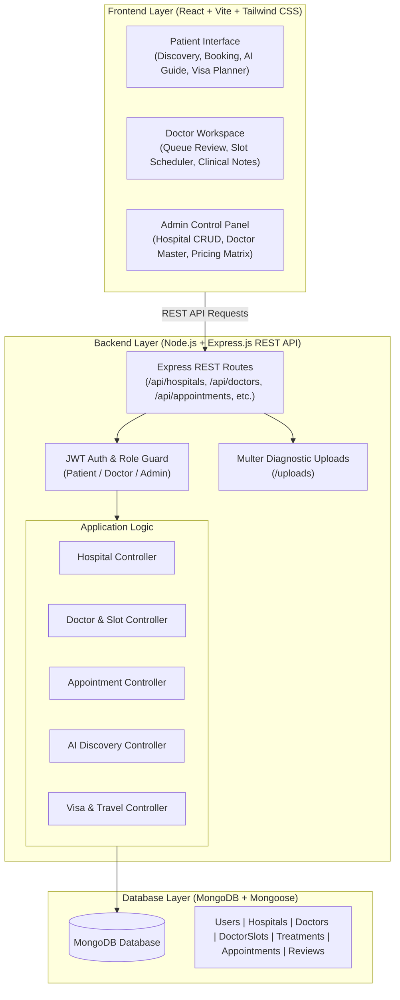
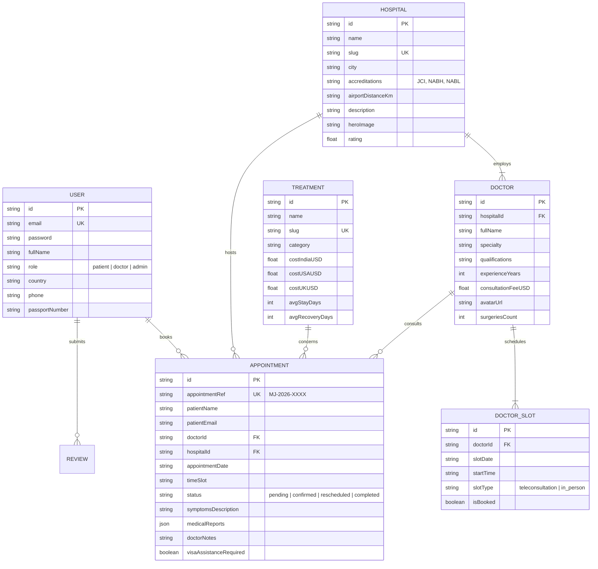

# MediJourney India – Integrated Digital Platform for International Patients Seeking Medical Treatment in India

[](https://sih.gov.in/)
[]()
[]()

> **SIH 2026 Problem Statement**: Development of an Integrated Digital Platform for International Patients Seeking Medical Treatment in India.

---

## 📌 Executive Summary & Problem Addressed

India is emerging as a premier global destination for specialized medical treatments including cosmetic surgery, full-mouth dental implants, IVF and fertility care, hair restoration, robotic joint replacement, beating-heart cardiology, and oncology. However, international patients previously suffered from:
1. Fragmented information across disparate hospital sites.
2. Inability to compare treatment packages and transparent costs vs Western benchmarks (USA / UK / EU).
3. Friction in coordinating doctor teleconsultations before overseas travel.
4. Difficulty in obtaining hospital visa invitation letters for the Indian **e-Medical Visa (MED)**.
5. Lack of unified medical records transfer and airport logistics coordination.

**MediJourney India** solves this with a unified, transparent, and responsive platform integrating patient discovery, clinical cost comparison, real-time doctor slot scheduling, medical dossier transfers, visa logistics, and dedicated doctor & administrative management portals.

---

## 🚀 Key Features & User Roles

### 1. International Patient Portal
- **Healthcare Discovery**: Search and filter JCI/NABH accredited hospitals and clinics across Delhi NCR, Mumbai, Chennai, Bengaluru, Hyderabad, and Kochi.
- **Specialist Directory**: View surgeon credentials, surgery counts, languages spoken (English, Arabic, Russian, French), and patient feedback.
- **Cost Benchmark Matrix**: Interactive procedure pricing comparison (USA vs UK vs Thailand vs India) showing 70–90% cost savings.
- **Side-by-Side Comparison Tool**: Compare up to 3 medical procedures or hospital packages simultaneously.
- **Direct Appointment & Slot Request**: Pick live doctor availability slots, upload medical diagnostic reports (MRI/X-rays/PDF), and receive instant reference code (`MJ-2026-XXXX`).
- **AI Medical Discovery Assistant**: Intelligent triage engine recommending matching clinical specialties, accredited hospitals, and estimated costs based on symptoms.
- **e-Medical Visa & Travel Logistics Guide**: Step-by-step guidance for Indian e-Medical Visa, attendant visas, city guides, and currency converter.

### 2. Healthcare Provider & Doctor Portal
- **Doctor Consultation Queue**: Review incoming patient requests with symptoms and uploaded medical files.
- **Clinical Actions**: Confirm appointments, propose new dates/slots, and write official medical notes & preliminary treatment plans.
- **Availability & Slot Scheduler**: Define custom teleconsultation vs in-person time slots for upcoming dates.
- **Doctor Metrics**: Live counters for pending requests, confirmed video consults, and overseas patient volume.

### 3. Platform Administrator Portal
- **Healthcare Provider Management**: Onboard new accredited hospitals, edit details, and verify facilities.
- **Doctor Master Directory**: Manage specialist credentials, assign hospital affiliations, and update consultation fees.
- **Procedures & Pricing Matrix**: Maintain catalog of surgical treatments, recovery timelines, and global cost benchmarks.
- **Master Appointments Ledger**: Full audit and search of all international consultation requests across India.
- **Platform Analytics**: Geographic patient origin breakdown and specialty demand trends.

---

## 📐 System Architecture



---

## 🗄️ Entity-Relationship (ER) Diagram



---

## 🛠️ Technology Stack

| Layer | Technologies Used |
| :--- | :--- |
| **Frontend** | React 18, Vite, Tailwind CSS, Lucide Icons, Canvas Confetti, Axios, React Router v6 |
| **Backend** | Node.js, Express.js REST API, JSON Web Token (JWT), bcryptjs, Multer |
| **Database** | MongoDB (Mongoose ODM) |
| **Design Tokens** | Medical Teal `#0D9488`, Deep Navy `#0A1128`, Emerald `#10B981`, Amber Gold `#F59E0B` |

---

## 💻 Installation & Running Locally

### Prerequisites
* **Node.js** (v18 or higher)
* **MongoDB** (running locally on `mongodb://127.0.0.1:27017` or configured via `.env`)

### 1. Start the Backend API Server
```bash
cd server
npm install
node server.js
```
*The server automatically connects to MongoDB, auto-seeds initial accredited hospitals, doctors, and treatments if empty, and runs on `http://localhost:5000`.*

### 2. Start the Frontend Client
```bash
cd client
npm install
npm run dev
```
*The frontend will run on `http://localhost:5173` with automatic API proxying to `localhost:5000`.*

---

## 🧪 Pre-Configured Test Accounts (Evaluation Credentials)

Use the built-in **Demo Role Switcher** in the top navigation bar or log in with:

| Role | Email | Password | Access Details |
| :--- | :--- | :--- | :--- |
| **Patient** | `sarah.jenkins@gmail.com` | `Patient@123456` | UK Patient with Active Requests |
| **Doctor** | `dr.naresh@medanta.org` | `Doctor@123456` | Dr. Naresh Trehan (Chief Surgeon) |
| **Administrator** | `admin@medijourney.in` | `Admin@123456` | Platform Central Command |

---

## 👥 Team Contribution Record (SIH Deliverable)

| Team Member | Roll / Reg No. | Key Responsibilities & Implementation Areas |
| :--- | :--- | :--- |
| **Member 1 (Team Leader)** | - | Full-Stack Architecture, Database Schema, System Design & Coordination |
| **Member 2** | - | Backend REST APIs, Express Routing & Controller Logic |
| **Member 3** | - | Database Modeling, MongoDB Integration & Data Seeding |
| **Member 4** | - | Patient UI Development, Directory Search, Filter Engine & Booking Flow |
| **Member 5** | - | Doctor & Admin Portals, Availability Scheduler, Dossier Review |
| **Member 6** | - | AI Discovery Matcher, Visa Guidelines & Multi-Currency Converter |

---
*Developed for Smart India Hackathon (SIH 2026).*
